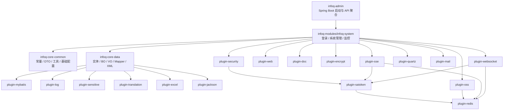

# infoq-scaffold-backend 架构说明

本文档是对当前代码结构的保守描述。

- 只写仓库里已经能直接确认的模块关系和装配行为。
- 不把未验证的插件链路包装成“既定平台能力”。
- 如果未来模块边界变化，应把这里视为“当前实现说明”而不是长期真理。

## 0. 下钻阅读入口

如果你已经知道要看哪一层，不要只停留在这份架构摘要里：

- 启动、profile、打包入口：[`../infoq-admin/README.md`](../infoq-admin/README.md)
- 公共类型、实体、BO/VO、Mapper、XML：[`../infoq-core/README.md`](../infoq-core/README.md)
- 系统业务接口、runner、listener、monitor：[`../infoq-modules/README.md`](../infoq-modules/README.md)
- Web、安全、Redis、Sa-Token、MyBatis、日志、SSE、WebSocket、Quartz、OSS、Excel：[`../infoq-plugin/README.md`](../infoq-plugin/README.md)

这份文档负责“关系梳理”，更贴近代码的真值说明在各父模块和叶子模块的 `README.md` 中。

## 1. 模块分层



上图对应的是当前 `pom.xml` 直接声明出来的依赖关系，而不是抽象的领域分层。

补充一个当前实现上的重要区别：

- `plugin-web`、`plugin-security`、`plugin-satoken`、`plugin-redis`、`plugin-mybatis`、`plugin-doc`、`plugin-encrypt`、`plugin-log`、`plugin-mail`、`plugin-quartz`、`plugin-sse`、`plugin-websocket`、`plugin-jackson`、`plugin-translation` 主要通过 `AutoConfiguration.imports` 进入运行时。
- `plugin-oss`、`plugin-excel`、`plugin-sensitive` 当前更像库模块，由业务层或数据层直接调用，而不是单独靠自动装配开放端点。

## 2. 各模块当前职责

| 模块 | 当前职责 | 当前证据 |
| --- | --- | --- |
| `infoq-admin` | 单体应用启动、打包、对外暴露 Spring 容器 | `infoq-admin/pom.xml`、`SysAdminApplication` |
| `infoq-system` | 登录、注册、验证码、系统管理、监控接口、业务服务实现 | `controller/login`、`controller/system`、`controller/monitor`、`service/impl` |
| `infoq-core-common` | 常量、通用 DTO、异常、工具、线程池/校验/应用配置 | `common/constant/*`、`common/config/*` |
| `infoq-core-data` | 系统实体、BO/VO、Mapper 接口、Mapper XML | `system/domain/*`、`system/mapper/*`、`resources/mapper/system/*` |
| `plugin-jackson` | Jackson 序列化、时间反序列化、JSON 工具与校验注解 | `JacksonConfig`、`JsonUtils`、`JsonPatternValidator` |
| `plugin-security` | Sa-Token 拦截、统一 URL 收集、免鉴权路径排除 | `SecurityConfig`、`AllUrlHandler` |
| `plugin-satoken` | 登录态、JWT、`LoginHelper`、Sa-Token 异常处理 | `SaTokenConfig`、`SaTokenExceptionHandler` |
| `plugin-web` | Web 基础自动配置与全局异常处理 | `FilterConfig`、`ResourcesConfig`、`CaptchaConfig`、`GlobalExceptionHandler` |
| `plugin-mybatis` | Mapper 扫描、分页、数据权限、乐观锁、填充策略 | `MybatisPlusConfig` |
| `plugin-redis` | Redisson 编解码、缓存、限流、防重提交异常处理 | `RedisConfig`、`CacheConfig`、`RateLimiterConfig`、`IdempotentConfig` |
| `plugin-log` | `@Log` AOP 与操作日志事件 | `LogAspect`、`OperLogEvent` |
| `plugin-doc` | SpringDoc 自动配置 | `SpringDocConfig` |
| `plugin-encrypt` | MyBatis 字段加解密与 API 请求解密 | `EncryptorAutoConfiguration`、`ApiDecryptAutoConfiguration` |
| `plugin-translation` | 返回值翻译，补齐部门、字典、用户、OSS 展示值 | `TranslationConfig`、`*TranslationImpl` |
| `plugin-sensitive` | 字段脱敏注解与 Jackson 脱敏序列化处理 | `Sensitive`、`SensitiveHandler` |
| `plugin-excel` | Excel 导入导出注解、监听器、转换器与工具类 | `ExcelUtil`、`DefaultExcelListener`、`Excel*Convert` |
| `plugin-oss` | OSS 客户端、工厂与上传结果封装 | `OssFactory`、`OssClient`、`OssProperties` |
| `plugin-sse` | SSE 自动配置，供业务侧可选调用 | `SseAutoConfiguration`、`OptionalSseHelper` |
| `plugin-quartz` | Quartz 托管任务自动配置 | `QuartzAutoConfiguration` |
| `plugin-mail` | 邮件发送自动配置，当前由 `OptionalMailHelper` 反射调用 | `MailConfig`、`OptionalMailHelper` |
| `plugin-websocket` | WebSocket 自动配置，当前配置默认关闭 | `WebSocketConfig` |

如果要继续确认这些职责的入口类、配置项和边界，请继续下钻到 [`../infoq-plugin/README.md`](../infoq-plugin/README.md) 与对应叶子模块 README。

## 3. 启动与装配路径

### 3.1 应用入口

[SysAdminApplication](../infoq-admin/src/main/java/cc/infoq/admin/SysAdminApplication.java) 是唯一启动入口：

- 使用 `@SpringBootApplication(scanBasePackages = "cc.infoq")` 收拢所有模块。
- 应用成功启动后会输出 `infoq-scaffold-backend started successfully`。

### 3.2 配置分层

当前后端的配置由"通用 `application.yml` + 当前激活 profile"两层叠加构成。凡是提到"默认配置"时都必须按这两层一起读。

#### 3.2.1 通用 `application.yml`

[application.yml](../infoq-admin/src/main/resources/application.yml) 承载通用运行时行为配置，当前明确表达了这些关键事实：

- Web 容器使用 Undertow。
- 默认开启验证码校验（`captcha.enable=true`）。
- `spring.profiles.active=@profiles.active@`，实际激活值由 Maven profile 注入。
- `spring.jackson.deserialization.fail_on_unknown_properties=true`，请求字段不匹配时显式失败。
- Sa-Token：`token-name=Authorization`，启用 JWT（`jwt-secret-key`）。
- `api-decrypt.enabled=true`，请求解密头标识是 `encrypt-key`。
- `springdoc.api-docs.enabled=true`。
- `sse.enabled=true`，`websocket.enabled=false`。
- `infoq.quartz.enabled=true`；Quartz 使用 JDBC 持久化，表前缀是 `QRTZ_`（位于 `spring.quartz.properties.org.quartz.jobStore.tablePrefix`）。
- 同时还包含 MyBatis-Plus、`mybatis-encryptor`、`xss`、`lock4j`、`security.excludes` 排除路径、`infoq.quartz.bootstrap` 默认值等行为配置。

它不承载 datasource、Redis、Redisson 或 mail 的实际环境连接参数；这些由 profile 文件补充。

#### 3.2.2 Profile 文件 `application-{dev,prod,local}.yml`

仓库当前存在三份 profile 文件，且 `pom.xml` 把 `<id>dev</id>` 设为 `<activeByDefault>true</activeByDefault>`，因此"不指定 profile"时运行的是 dev profile。

- [application-dev.yml](../infoq-admin/src/main/resources/application-dev.yml) 补充/覆写开发环境基础设施：
  - `spring.datasource`（HikariCP + dynamic-datasource，默认 `master` 指向本地 MySQL）。
  - `spring.data.redis`（单机配置，默认 `localhost:6379`）。
  - `redisson`（连接池、`keepAlive`、订阅连接等）。
  - `spring.quartz.overwrite-existing-jobs=true`，`jobStore.isClustered=false`。
  - `infoq.quartz.bootstrap` 开发环境差异（`reconcile-enabled=true`、`production-guard-enabled=false`、`marker-enabled=false`）。
  - `mail.enabled=false` 与 SMTP 示例值。
- [application-prod.yml](../infoq-admin/src/main/resources/application-prod.yml) 补充/覆写生产环境 datasource、Redis、Redisson、`spring.quartz`、`infoq.quartz.bootstrap`、mail。
- [application-local.yml](../infoq-admin/src/main/resources/application-local.yml) 补充/覆写本地联调 datasource、Redis、Redisson、mail，但不重写 Quartz 相关配置。

因此本文档其余章节里出现的"`api-decrypt.enabled=true`"、"`sse.enabled=true`"、"Quartz 表前缀 `QRTZ_`"等具体值，来自通用 `application.yml`；datasource、Redis、Redisson、mail 等连接信息来自当前激活 profile。

### 3.3 自动配置拼装

当前后端不是在 `infoq-system` 里手写所有配置，而是由插件模块把基础设施装进容器：

- `plugin-security` 注入 Sa-Token 拦截，并排除 `/monitor/health` 与 SSE 路径。
- `plugin-satoken` 提供 `LoginHelper`、JWT 集成与 Sa-Token 异常处理。
- `plugin-encrypt` 在 `api-decrypt.enabled=true` 时注册 `CryptoFilter`，并在 `mybatis-encryptor.enable=true` 时装配 MyBatis 字段加解密拦截器。
- `plugin-mybatis` 负责 `@MapperScan("${mybatis-plus.mapperPackage}")`、分页、数据权限、乐观锁。
- `plugin-redis` 负责 Redisson codec、线程、key prefix 和 Redis 异常处理。
- `plugin-mail` 通过 `MailConfig` 和 `MailProperties` 提供邮件发送所需的自动配置与工具类。
- `plugin-web` 负责 Web 层公共配置与统一异常出口。
- `plugin-log` 把 `@Log` 注解变成 `OperLogEvent`。
- `plugin-doc`、`plugin-encrypt`、`plugin-sse`、`plugin-quartz`、`plugin-websocket` 分别装配文档、加密、SSE、定时任务、WebSocket 能力。

其中 `plugin-redis` 与 `plugin-satoken` 对 `infoq-system` 来说主要是传递依赖：

- `plugin-security -> plugin-satoken -> plugin-redis`
- `plugin-oss -> plugin-redis`
- `plugin-sse -> plugin-satoken + plugin-redis`
- `plugin-websocket -> plugin-satoken + plugin-redis`

## 4. 请求处理主干

### 4.1 从 HTTP 到业务

当前大多数管理端接口都沿着下面这条路径运行：

```text
HTTP Request
-> CryptoFilter(当 api-decrypt.enabled=true 时先经过；带 @ApiEncrypt 的 POST/PUT 会在这里校验 encrypt-key)
-> SecurityConfig / Sa-Token 拦截
-> Controller
-> Service
-> Mapper(MyBatis-Plus / XML)
-> MySQL
-> ApiResult / TableDataInfo 返回
```

这个主干在多个控制器中都能看到，例如：

- 登录：`AuthController -> AuthStrategy -> SysLoginServiceImpl / SysUserMapper`
- 菜单：`SysMenuController -> SysMenuServiceImpl -> SysMenuMapper`
- 用户：`SysUserController -> SysUserServiceImpl -> SysUserMapper + 关联 Mapper`
- 监控：`CacheController / DataSourceController / ServerController`

对于 `GET` 请求或未标注 `@ApiEncrypt` 的接口，`CryptoFilter` 基本只做透传；真正强制要求加密头的是被 `@ApiEncrypt` 标注的 `POST/PUT` 接口。

### 4.2 控制器分组

`infoq-system` 当前按目录把 API 分成三组：

- `controller/login`: 登录、注册、验证码、首页。
- `controller/system`: 用户、角色、菜单、部门、岗位、配置、通知、字典、OSS、个人资料、客户端等后台管理接口。
- `controller/monitor`: 在线用户、登录日志、操作日志、缓存、数据源、服务器、任务等运行态接口。

## 5. 安全、权限与数据权限

### 5.1 URL 收集与拦截

[AllUrlHandler](../infoq-plugin/infoq-plugin-security/src/main/java/cc/infoq/common/security/handler/AllUrlHandler.java) 会在初始化阶段遍历 Spring MVC 的全部 `RequestMapping`，把路径变量替换成 `*` 后缓存起来。

[SecurityConfig](../infoq-plugin/infoq-plugin-security/src/main/java/cc/infoq/common/security/config/SecurityConfig.java) 再基于这份 URL 列表做统一拦截：

- 除 `security.excludes` 和 SSE path 外，其余路径默认都进入 Sa-Token 校验。
- 先检查是否已登录。
- 再校验请求头或参数里的 `clientId` 是否与 token extra 中保存的客户端标识一致。

这意味着当前系统不是单纯“带 token 就能访问”，而是显式把“token 属于哪个 clientId”也纳入运行时约束。

需要注意的是，控制器级 Sa-Token 校验之前，请求已经先经过 Servlet Filter。当前默认配置里，带 `@ApiEncrypt` 的 `POST/PUT` 会先由 `CryptoFilter` 判断是否携带 `encrypt-key` 头，再决定是否放行到控制器。

### 5.2 权限来源

权限模型当前由 `SysPermissionServiceImpl` 组装：

- 角色权限来自 `SysRoleService`。
- 菜单权限来自 `SysMenuService`。
- 超级管理员走硬编码兜底：角色 `superadmin`、菜单权限 `*:*:*`。

控制器侧再通过 `@SaCheckPermission`、`@SaCheckRole` 落地校验。

### 5.3 数据权限

MyBatis 层由 `MybatisPlusConfig` 注入 `PlusDataPermissionInterceptor` 和 `DataPermissionPointcutAdvisor`。

业务代码里也能看到显式绕过场景，例如 `SysUserController.getInfo()` 使用 `DataPermissionHelper.ignore(...)` 获取当前登录人的完整信息，说明当前系统的数据权限并不完全隐式，而是允许局部按需绕过。

## 6. 数据与状态承载

### 6.1 MySQL 侧

从 Mapper、实体和 XML 可以确认当前系统至少围绕这些表族运转：

- 用户与组织：`sys_user`、`sys_dept`、`sys_post`
- 权限关系：`sys_role`、`sys_menu`、`sys_user_role`、`sys_role_menu`、`sys_user_post`
- OAuth-like 客户端：`sys_client`
- 审计：`sys_login_info`、`sys_oper_log`
- 调度：`QRTZ_*`

其中 `sys_user` 的复杂查询仍使用 XML，例如 [SysUserMapper.xml](../infoq-core/infoq-core-data/src/main/resources/mapper/system/SysUserMapper.xml) 里的导出、已分配/未分配角色查询。

### 6.2 Redis 侧

当前代码能直接确认的关键 Redis 状态包括：

- `global:captcha_codes:*`：验证码
- `pwd_err_cnt:*`：登录失败计数
- `online_tokens:*`：在线用户态
- `global:repeat_submit:*`：防重提交
- `global:rate_limit:*`：限流
- `global:sys_client#30d` 等缓存组：客户端与系统缓存

这些 key 前缀来自 `GlobalConstants`、`CacheConstants`、`CacheNames`。

## 7. 异常处理与显式失败

当前后端不是通过静默 fallback 吞错，而是尽量把错误转成明确的响应：

- `GlobalExceptionHandler` 统一处理 `ServiceException`、校验异常、JSON 解析异常、请求体不可读异常、SpEL 异常等。
- `SaTokenExceptionHandler` 统一把未登录、无权限、无角色转换成 `401/403` 语义的 `ApiResult`。
- `application.yml` 显式开启 `fail_on_unknown_properties`，避免前端传错字段时被静默忽略。

唯一明显的例外是 SSE 连接断开：

- `GlobalExceptionHandler` 对 SSE 的 `IOException` 和超时做了特殊处理，避免把浏览器关闭连接当成真正系统故障刷屏。

## 8. 日志与监控切入点

### 8.1 文件日志

[logback-plus.xml](../infoq-admin/src/main/resources/logback-plus.xml) 默认会把日志写到仓库根 `logs/`；容器场景通过 `INFOQ_LOG_PATH=/infoq/server/logs` 覆盖：

- `sys-console.log`
- `sys-info.log`
- `sys-error.log`

### 8.2 审计日志

当前有两条非常明确的审计链路：

1. 登录日志
   `SysLoginServiceImpl/UserActionListener -> LoginInfoEvent -> SysLoginInfoServiceImpl -> sys_login_info`
2. 操作日志
   `@Log -> LogAspect -> OperLogEvent -> SysOperLogServiceImpl -> sys_oper_log`

### 8.3 运行态监控接口

`controller/monitor` 当前已经暴露了多组运维入口：

- `/monitor/cache`
- `/monitor/dataSource`
- `/monitor/server`
- `/monitor/online`
- `/monitor/loginInfo`
- `/monitor/operLog`
- `/monitor/job`
- `/monitor/jobLog`

此外 `HealthController` 暴露了轻量级 `/monitor/health` 健康检查接口，并由 `SecurityConfig` 显式放行。

## 9. 当前可确认的可选链路

只记录代码能直接证实的内容：

- SSE：
  `sse.enabled=true`，登录成功后会由 `AuthController` 延迟 5 秒向当前用户推送欢迎消息；真正发送动作通过 `OptionalSseHelper` 反射调用插件能力。
- 邮件验证码：
  `CaptchaController` 暴露了 `/resource/email/code`，但真正可用还取决于 `mail.enabled` 和邮件插件是否就绪。
- WebSocket：
  自动配置类存在，但 `application.yml` 当前 `websocket.enabled=false`。

这些链路在文档里应始终被视为“当前实现可选项”，而不是无条件在线能力。
