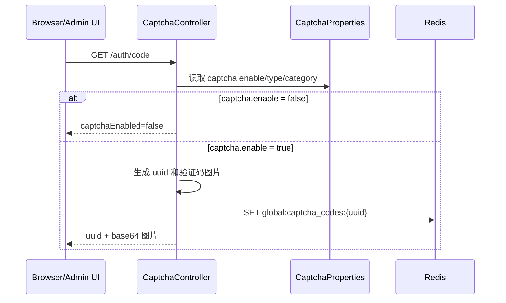
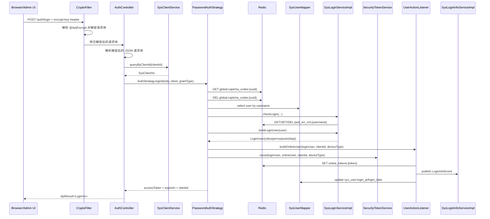
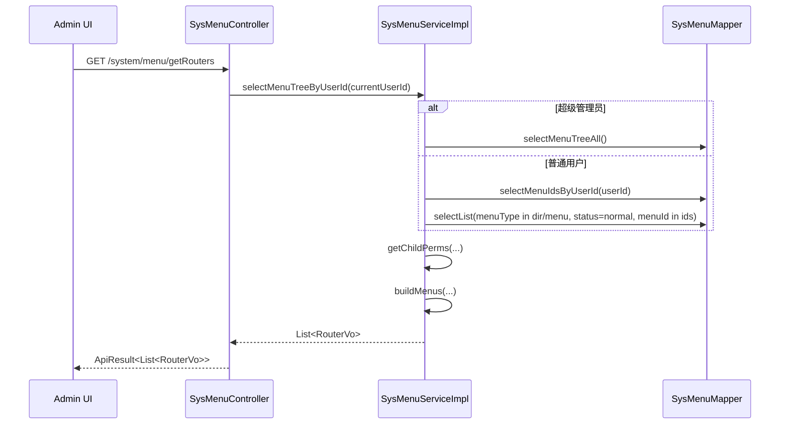

# infoq-scaffold-backend 关键数据流

本文档只记录当前代码能直接追到的几条主链路：

- 验证码与登录
- 公开注册、邀请码与默认归属
- 登录后的用户信息与路由装配
- 用户管理的典型写链路
- 登录日志、操作日志与监控链路

如果某条链路未来被插件化、拆模块或改表，这里应按“当前实现说明”更新，而不是保留过时抽象。

## 0. 链路下钻入口

这份文档只讲关键链路，不重复展开模块职责。需要落到代码层时，建议按下面顺序下钻：

- 登录、系统管理、监控链路：[`../infoq-modules/infoq-system/README.md`](../infoq-modules/infoq-system/README.md)
- 公共模型、Entity、BO/VO、Mapper、XML：[`../infoq-core/infoq-core-common/README.md`](../infoq-core/infoq-core-common/README.md)、[`../infoq-core/infoq-core-data/README.md`](../infoq-core/infoq-core-data/README.md)
- 加解密、安全、Redis、SSE、Quartz、WebSocket：[`../infoq-plugin/README.md`](../infoq-plugin/README.md)

## 1. 关键状态载体

| 载体 | 当前用途 | 代码证据 |
| --- | --- | --- |
| `sys_client` | 登录前校验 `clientId`、`grantType`、token 时效、设备类型 | `AuthController`、`SysClientServiceImpl` |
| `sys_user` | 登录用户、用户管理主表 | `PasswordAuthStrategy`、`SysUserServiceImpl` |
| `sys_config` | 系统参数值与配置中心 UI 元数据；业务读取仍以 `configKey -> configValue` 为稳定路径 | `SysConfigServiceImpl`、`SysConfigController` |
| `sys_invite_code` | 邀请码生成、校验、作废、过期与消费 | `SysInviteCodeServiceImpl`、`SysInviteCodeMapper.xml` |
| `sys_role` / `sys_menu` / 关联表 | 角色权限、菜单权限、前端路由 | `SysPermissionServiceImpl`、`SysMenuServiceImpl` |
| `sys_login_info` | 登录审计日志 | `SysLoginInfoServiceImpl` |
| `sys_oper_log` | 操作审计日志 | `LogAspect`、`SysOperLogServiceImpl` |
| `QRTZ_*` | Quartz JDBC 任务存储 | `application.yml` |
| `global:captcha_codes:*` | 图形验证码、邮箱验证码 | `CaptchaController`、`PasswordAuthStrategy`、`EmailAuthStrategy` |
| `pwd_err_cnt:*` | 登录失败次数与锁定窗口 | `SysLoginServiceImpl.checkLogin` |
| `online_tokens:*` | 在线用户快照 | `UserActionListener` |
| `global:repeat_submit:*` | 防重提交 | `RepeatSubmit` 相关 Redis 插件 |
| `global:rate_limit:*` | 限流 | `RateLimiter` 相关 Redis 插件 |

## 2. 图形验证码 + 密码登录

### 2.0 请求进入登录控制器之前

当前通用 [application.yml](../infoq-admin/src/main/resources/application.yml) 中 `api-decrypt.enabled=true`（参见 `architecture.md` §3.2），而 [AuthController](../infoq-modules/infoq-system/src/main/java/cc/infoq/system/controller/login/AuthController.java) 的 `/auth/login`、`/auth/register` 都带 `@ApiEncrypt`。

这意味着登录链路不是“浏览器直接把明文 JSON 交给控制器”，而是先经过 [CryptoFilter](../infoq-plugin/infoq-plugin-encrypt/src/main/java/cc/infoq/common/encrypt/filter/CryptoFilter.java)：

- Filter 会先定位当前 handler method 是否带 `@ApiEncrypt`。
- 对带注解的 `POST/PUT`，如果缺少 `encrypt-key` 头，会直接返回 `403`，请求不会进入控制器。
- 如果头存在，则 Filter 先解密请求体，控制器收到的才是解密后的 JSON 字符串。
- `@ApiEncrypt` 默认 `response=false`，所以登录响应本身不会因为这个注解自动加密。

### 2.1 验证码生成流

入口是 [CaptchaController#getCode](../infoq-modules/infoq-system/src/main/java/cc/infoq/system/controller/login/CaptchaController.java)。



当前实现要点：

- 如果验证码关闭，接口不会继续走限流与生成逻辑，而是直接返回 `captchaEnabled=false`。
- 如果验证码开启，控制器会把答案写入 `global:captcha_codes:{uuid}`，过期时间是 `Constants.CAPTCHA_EXPIRATION`，当前值为 2 分钟。
- 图形验证码接口本身还带了基于 IP 的限流：`@RateLimiter(time = 60, count = 10, limitType = IP)`。

### 2.2 密码登录流

入口是 [AuthController#login](../infoq-modules/infoq-system/src/main/java/cc/infoq/system/controller/login/AuthController.java) 和 [PasswordAuthStrategy](../infoq-modules/infoq-system/src/main/java/cc/infoq/system/service/impl/PasswordAuthStrategy.java)。



当前实现要点：

- `CryptoFilter` 先根据 `@ApiEncrypt` 校验 `encrypt-key` 头；缺头时会在 Filter 层直接拒绝。
- `AuthController` 解析的是解密后的 JSON 请求体，并只先校验 `clientId` 和 `grantType`，说明登录接口把“客户端是否合法”作为第一道门槛。
- `SysClientServiceImpl.queryByClientId` 结果带缓存，缓存组名是 `global:sys_client#30d`。
- `PasswordAuthStrategy` 校验验证码时会删除 Redis 验证码 key，因此同一验证码不会重复使用。
- `SysLoginServiceImpl.checkLogin` 使用 `pwd_err_cnt:{username}` 记录错误次数，达到阈值后直接抛出 `UserException`。
- `buildLoginUser` 会同步聚合部门、角色、岗位、菜单权限和角色权限，因此 token 建立前就已经拿到大部分鉴权上下文。
- token session 会保存 `clientId`、设备类型、超时时间、活跃超时和完整 `LoginUser`；后续每个请求都会再经过客户端一致性校验。

这条链路的模块下钻顺序通常是：

1. [`../infoq-modules/infoq-system/README.md`](../infoq-modules/infoq-system/README.md)
2. [`../infoq-plugin/infoq-plugin-encrypt/README.md`](../infoq-plugin/infoq-plugin-encrypt/README.md)
3. [`../infoq-plugin/infoq-plugin-security/README.md`](../infoq-plugin/infoq-plugin-security/README.md)
4. [`../infoq-plugin/infoq-plugin-redis/README.md`](../infoq-plugin/infoq-plugin-redis/README.md)

## 3. 邮箱验证码、邮箱登录与公开注册

当前代码明确支持第二种认证策略，但它是可选能力。

### 3.1 邮箱验证码发送

入口是 `GET /resource/email/code`：

- `CaptchaController.emailCode()` 先检查 `OptionalMailHelper.isEnabled()`。
- 若 `mail.enabled=false`，直接返回“当前系统没有开启邮箱功能”。
- 若开启，则走 `emailCodeImpl()`：
  - 生成 4 位数字验证码；
  - 写入 `global:captcha_codes:{email}`；
  - 通过 `OptionalMailHelper.sendText(...)` 反射调用邮件插件发送。
- 若 `scene=register` 且 `sys.account.inviteRegister=true`，控制器会先校验邀请码可用，再允许发送注册验证码。

### 3.2 邮箱登录

如果登录请求里的 `grantType=email`，`AuthStrategy.login(...)` 会分发到 [EmailAuthStrategy](../infoq-modules/infoq-system/src/main/java/cc/infoq/system/service/impl/EmailAuthStrategy.java)：

- 按邮箱查询用户；
- 从 `global:captcha_codes:{email}` 读取验证码；
- 沿用 `SysLoginServiceImpl.checkLogin(...)` 做失败计数；
- 后续 token 建立、在线用户记录、登录日志落库流程与密码登录一致。

因此当前系统的多认证方式并不是两套完全独立管线，而是“不同凭证校验 + 共享登录后处理”。

### 3.3 公开注册 + 邀请码消费

当前公开注册入口由三个接口协同完成：

- `GET /auth/code`：除图形验证码内容外，还会补充 `registerEnabled`、`inviteRegisterEnabled`、`forgotPasswordEnabled`、`mailEnabled`，供公开页决定是否显示注册入口、邀请码输入框和验证码发送能力。
- `GET /auth/invite/code/check`：公开页在邀请码输入框失焦时调用；当邀请码功能关闭或邀请码不可用时，统一返回失败，前端统一提示“邀请码不可用”。
- `POST /auth/register`：仍然是注册总入口，但在 `sys.account.inviteRegister=true` 时会额外要求邀请码可用，并在进入注册事务前拒绝“邀请码功能开启但邮箱能力关闭”的场景。

注册写链路的当前实现要点如下：

1. `AuthController.register()` 先检查 `sys.account.registerUser` 总开关。
2. 若邀请码注册开启，则控制器先校验邮件能力可用，再校验邀请码可用。
3. `SysRegisterServiceImpl.register()` 在事务内校验邮箱验证码、用户名/邮箱唯一性，并构造默认归属：
   - `sys_role.role_key=owner`
   - `sys_post.post_code=user`
   - `sys_dept.dept_id=112`
4. `SysUserServiceImpl.registerUser()` 成功写入用户、用户-角色、用户-岗位关系后，注册事务会继续消费邀请码。
5. 邀请码消费走 `SysInviteCodeMapper.consumeInviteCode(...)`，SQL 条件要求 `status='0'` 且 `expire_time > now`，因此并发提交时只会有一个请求成功把同一个邀请码置为已使用。

这条链路说明当前公开注册并不是“前端自己拼规则”，而是由 backend 统一下发能力位、统一校验邀请码、统一分配默认归属，并在事务里完成邀请码一次性消费。

### 3.4 参数配置中心

后台参数设置由 [SysConfigController](../infoq-modules/infoq-system/src/main/java/cc/infoq/system/controller/system/SysConfigController.java) 与 [SysConfigServiceImpl](../infoq-modules/infoq-system/src/main/java/cc/infoq/system/service/impl/SysConfigServiceImpl.java) 承载：

- 旧业务读取路径保持不变：`selectConfigByKey(configKey)` 只返回 `configValue` 字符串，并使用 `sys_config` 缓存。
- 配置中心新增 `GET /system/config/panel`，按后端固定分组返回 `groupKey`、`groupName`、`displayOrder` 和配置项集合，React / Vue 不各自硬编码分组名称。
- `configType` 仍表示“是否系统内置”（`Y` / `N`），不表示参数值类型；值类型由 `valueType` 表达。
- `resetByKey` 由后端读取 `defaultValue` 后恢复默认，并通过缓存写入策略返回新值；当注册总开关恢复或修改为 `false` 时，会同步关闭邀请码注册并清理对应缓存。
- 账号敏感配置 `sys.account.registerUser`、`sys.account.inviteRegister`、`sys.account.forgotPassword` 只允许超级管理员修改。

## 4. 登录后的用户信息与路由装配

### 4.1 受保护请求先过安全过滤器

所有非排除路径请求，都会进入安全链路；其中带 `@ApiEncrypt` 的 `POST/PUT` 还会先经过 `CryptoFilter`，再进入 Spring Security token filter：

1. 从 `Authorization: Bearer <token>` 读取 access token。
2. 校验 JWT 签名、Redis session、revocation marker、过期时间与活跃时间。
3. 从请求头或 query 读取 `clientId`。
4. 与 token session 中登录时写入的 `clientId` 比对；缺失或不一致返回 401。

这条链路保证了当前 token 不只是“某用户已登录”，还是“该用户以哪个客户端身份登录”。

### 4.2 获取当前用户信息

入口是 [SysUserController#getInfo()](../infoq-modules/infoq-system/src/main/java/cc/infoq/system/controller/system/SysUserController.java)：

```text
GET /system/user/getInfo
-> LoginUserContext.getLoginUser()
-> DataPermissionHelper.ignore(() -> SysUserService.selectUserById(userId))
-> SysUserMapper.selectVoById + SysRoleMapper.selectRolesByUserId
-> 返回 user + permissions + roles
```

这里有两个值得记录的当前实现细节：

- 菜单权限和角色权限直接来自登录态里的 `LoginUser`，不是每次请求重新现算。
- 用户详情查询显式用 `DataPermissionHelper.ignore(...)` 包裹，说明“当前登录人读取自己的完整资料”被视为数据权限的特例。

### 4.3 获取前端路由

入口是 [SysMenuController#getRouters()](../infoq-modules/infoq-system/src/main/java/cc/infoq/system/controller/system/SysMenuController.java)。



当前实现要点：

- 菜单树只会装配目录和菜单类型，不包含所有表字段。
- `buildMenus(...)` 会把数据库里的菜单结构转成前端使用的 `RouterVo` / `MetaVo`。
- 顶级目录、菜单框架、内链的处理逻辑各不相同，都是在 `SysMenuServiceImpl` 里完成的，而不是前端二次推导。

如果要继续下钻这条链路，优先看：

- [`../infoq-modules/infoq-system/README.md`](../infoq-modules/infoq-system/README.md)
- [`../infoq-core/infoq-core-data/README.md`](../infoq-core/infoq-core-data/README.md)

## 5. 典型后台写链路：用户管理

用户管理可以代表当前大量后台 CRUD 的共性，因为它同时涉及校验、数据权限、事务、关联表和操作日志。

### 5.1 新增用户

入口是 [SysUserController#add](../infoq-modules/infoq-system/src/main/java/cc/infoq/system/controller/system/SysUserController.java)：

1. `@PreAuthorize("@securityAuthorizationService.hasPermission('system:user:add')")` 先做权限校验。
2. 控制器检查部门数据范围、用户名/手机号/邮箱唯一性。
3. 控制器层先用 `BCrypt.hashpw(...)` 处理密码。
4. `SysUserServiceImpl.insertUser(...)` 在事务里完成：
   - 插入 `sys_user`
   - 插入用户-岗位关系
   - 插入用户-角色关系
5. `@Log` 注解触发操作日志事件，异步落到 `sys_oper_log`。

这说明当前系统的用户写链路是“控制器做入口校验与密码预处理，Service 负责事务聚合”。

### 5.2 查询和导出用户

查询链路能看到当前数据访问的两种形态：

- 常规分页列表：
  `SysUserServiceImpl.selectPageUserList -> SysUserMapper.selectPageUserList(...)`
- 导出与复杂关联：
  `SysUserServiceImpl.selectUserExportList -> SysUserMapper.xml`

也就是说，当前仓库对“简单查询走 MyBatis-Plus、复杂查询走 XML”这件事是混合使用的，而不是强制单一路径。

对应的模块真值入口是：

- [`../infoq-modules/infoq-system/README.md`](../infoq-modules/infoq-system/README.md)
- [`../infoq-core/infoq-core-data/README.md`](../infoq-core/infoq-core-data/README.md)
- [`../infoq-plugin/infoq-plugin-mybatis/README.md`](../infoq-plugin/infoq-plugin-mybatis/README.md)

## 6. 登录日志、操作日志与在线用户

### 6.1 登录成功后的副作用

[UserActionListener](../infoq-modules/infoq-system/src/main/java/cc/infoq/system/listener/UserActionListener.java) 是认证行为辅助组件，token 签发成功后会触发三件事：

1. 组装 `UserOnlineDTO` 并写入 `online_tokens:{token}`。
2. 发布 `LoginInfoEvent`。
3. 回写 `sys_user.login_ip` 和 `sys_user.login_date`。

因此“用户登录成功”在当前实现里并不是只返回 token，而是会同时刷新在线态、审计态和用户最近登录信息。

### 6.2 登录日志流

```text
LoginInfoEvent
-> SysLoginInfoServiceImpl.recordLoginInfo()
-> 解析 User-Agent / IP / 地址 / client 信息
-> log.info(...)
-> insert sys_login_info
```

当前会记录的关键内容包括：

- 用户名
- 登录状态
- 消息文案
- IP 与归属地
- 浏览器与操作系统
- clientKey、deviceType

### 6.3 操作日志流

```text
@Log 注解方法
-> LogAspect.before/after
-> 采集 URL、方法、请求方式、请求参数、返回值、耗时、登录人
-> 发布 OperLogEvent
-> SysOperLogServiceImpl.recordOper()
-> insert sys_oper_log
```

当前实现里，操作日志是异步落库的；如果 AOP 采集本身出错，只会记录本地错误日志，不会反向中断业务请求。

## 7. 监控与运维数据流

### 7.1 Redis 监控

[CacheController](../infoq-modules/infoq-system/src/main/java/cc/infoq/system/controller/monitor/CacheController.java) 直接通过 `RedissonConnectionFactory` 获取连接，并调用：

- `connection.commands().info()`
- `connection.commands().info("commandstats")`
- `connection.commands().dbSize()`

所以 `/monitor/cache` 返回的不是业务表象指标，而是 Redis 原生 INFO/命令统计数据的整理结果。

### 7.2 连接池、服务器、任务

当前 `controller/monitor` 还明确暴露了：

- `/monitor/dataSource`：走 `DataSourceMonitorService`
- `/monitor/server`：走 `ServerMonitorService`
- `/monitor/job`、`/monitor/jobLog`：走 Quartz 任务管理与日志服务

这几条链路说明当前系统已经把“用户态后台管理”和“运行态可观测入口”放在同一个应用里。

### 7.3 `/monitor/health`

`HealthController` 提供轻量级健康检查接口 `/monitor/health`，当前直接返回 `"ok"`。
Spring Security public matcher 显式放行这个路径，因此它不依赖登录态，单独作为公开健康检查入口使用。

## 8. 当前可确认的可选通知链路

### 8.1 SSE 欢迎消息

`AuthController.login()` 在登录成功后会延迟 5 秒执行：

```text
OptionalSseHelper.publishToUsers(List.of(userId), welcomeMessage)
```

`OptionalSseHelper` 的行为是：

- 如果 `sse.enabled=false`，直接返回，不抛错。
- 如果配置开启但插件类缺失，会显式抛 `ServiceException`。
- 如果插件存在，则通过反射调用 `SseMessageUtils.publishMessage(...)`。

这条链路说明当前系统对 SSE 的态度是“允许关闭，但开启后要求真实可用”，不是静默假成功。

### 8.2 邮件验证码

`OptionalMailHelper` 的行为同样是保守的：

- `mail.enabled=false` 时，上层控制器直接拒绝。
- 如果已启用却没引入邮件插件，会抛 `ServiceException("未引入邮件插件，无法发送邮件验证码")`。

所以在当前实现里，邮件链路也是“显式启停 + 缺件即失败”。
